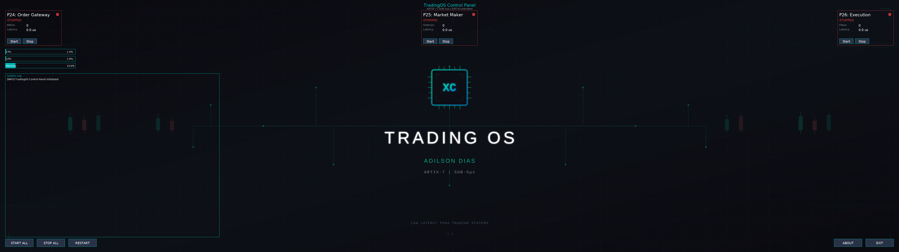

# TradingOS - Custom Linux Distribution for FPGA Trading



A minimal Linux distribution built with Buildroot, optimized for low-latency FPGA trading systems with NVIDIA GPU acceleration and PCIe passthrough.

## Overview

TradingOS is a custom Linux distribution designed to run the FPGA trading pipeline (Projects 24-29) with minimal overhead. Built using Buildroot's external tree mechanism, it provides:

- Kernel optimized for real-time trading workloads
- Xilinx XDMA driver for FPGA PCIe communication
- NVIDIA proprietary driver and CUDA runtime
- XGBoost library with GPU acceleration
- CPU isolation and real-time scheduling

## Target Hardware

| Component | Specification |
|-----------|---------------|
| CPU | Intel i9-14900KF (24 cores) |
| GPU | NVIDIA RTX 5090 |
| FPGA | Xilinx Artix-7 XC7A200T (AX7203) |
| RAM | 128+ GB DDR5 |
| Storage | NVMe SSD |
| Network | Intel I226-V 2.5GbE |

## Directory Structure

```
/work/tos/trading-linux/
├── README.md
├── run_qemu.sh                          # QEMU testing script
└── buildroot-external/
    ├── Config.in                        # Main external tree config
    ├── external.mk                      # External tree makefile
    ├── external.desc                    # External tree description
    │
    ├── configs/
    │   └── tradingos_defconfig          # Buildroot defconfig
    │
    ├── kernel-fragments/
    │   └── trading.config               # Linux kernel config fragment
    │
    ├── package/
    │   ├── Config.in                    # Package menu
    │   ├── xdma/                        # Xilinx XDMA driver
    │   │   ├── Config.in
    │   │   └── xdma.mk
    │   ├── nvidia-driver/               # NVIDIA proprietary driver
    │   │   ├── Config.in
    │   │   └── nvidia-driver.mk
    │   ├── cuda/                        # CUDA toolkit
    │   │   ├── Config.in
    │   │   └── cuda.mk
    │   └── xgboost/                     # XGBoost with CUDA
    │       ├── Config.in
    │       └── xgboost.mk
    │
    └── board/trading/
        ├── busybox.config               # BusyBox configuration
        ├── users.txt                    # System users
        └── overlay/                     # Root filesystem overlay
            ├── boot/grub/grub.cfg
            ├── etc/
            │   ├── kernel/cmdline
            │   ├── os-release
            │   ├── ssh/sshd_config
            │   ├── sudoers.d/trading
            │   ├── profile.d/trading-libs.sh
            │   ├── udev/rules.d/
            │   │   ├── 60-xdma.rules
            │   │   └── 99-skip-missing-hardware.rules
            │   └── systemd/
            │       ├── network/10-ethernet.network
            │       └── system/
            │           ├── trading-system.service
            │           └── ldconfig.service
            ├── opt/trading/
            │   ├── bin/bbo_benchmark
            │   └── model/itch_predictor.ubj
            └── usr/local/bin/
                ├── check-cpu-isolation.sh
                ├── check-nvidia.sh
                └── fix-libraries.sh
```

## Kernel Configuration

The kernel fragment (`kernel-fragments/trading.config`) enables:

### CPU Optimization
```
CONFIG_SMP=y
CONFIG_NR_CPUS=32
CONFIG_X86_INTEL_PSTATE=y
CONFIG_CPU_FREQ_GOV_PERFORMANCE=y
CONFIG_PREEMPT=y
CONFIG_HZ_1000=y
```

### Memory
```
CONFIG_TRANSPARENT_HUGEPAGE=y
CONFIG_HUGETLBFS=y
CONFIG_MEMORY_ISOLATION=y
```

### PCIe / DMA
```
CONFIG_PCI=y
CONFIG_PCIEPORTBUS=y
CONFIG_PCI_MSI=y
CONFIG_DMA_ENGINE=y
CONFIG_DMADEVICES=y
```

### NVIDIA GPU (External Module)
```
CONFIG_DRM=y
CONFIG_DRM_FBDEV_EMULATION=n
```

### Intel I226-V Network
```
CONFIG_IGC=y
```

### NVMe Storage
```
CONFIG_NVME_CORE=y
CONFIG_BLK_DEV_NVME=y
```

### Disabled Features (Minimal Kernel)
```
CONFIG_WIRELESS=n
CONFIG_BLUETOOTH=n
CONFIG_SOUND=n
CONFIG_DRM_I915=n
CONFIG_DRM_AMDGPU=n
CONFIG_KVM=n
```

## Boot Parameters

Kernel command line (`/etc/kernel/cmdline`):

```
isolcpus=14-23 nohz_full=14-23 rcu_nocbs=14-23
intel_pstate=performance
mitigations=off
transparent_hugepage=never
```

| Parameter | Purpose |
|-----------|---------|
| `isolcpus=14-23` | Isolate cores 14-23 from scheduler |
| `nohz_full=14-23` | Disable timer ticks on isolated cores |
| `rcu_nocbs=14-23` | Move RCU callbacks off isolated cores |
| `intel_pstate=performance` | Lock CPU at maximum frequency |
| `mitigations=off` | Disable Spectre/Meltdown mitigations |
| `transparent_hugepage=never` | Disable THP for predictable latency |

## Custom Packages

### XDMA Driver

Xilinx DMA driver for PCIe-based FPGA communication.

```makefile
XDMA_VERSION = 2025.2
XDMA_SITE = $(call github,Xilinx,dma_ip_drivers,$(XDMA_VERSION))
XDMA_MODULE_SUBDIRS = XDMA/linux-kernel/xdma
```

Creates device nodes:
- `/dev/xdma0_c2h_0` - Card-to-Host DMA channel
- `/dev/xdma0_h2c_0` - Host-to-Card DMA channel
- `/dev/xdma0_control` - Control registers

### NVIDIA Driver

Proprietary NVIDIA driver with kernel modules and userspace libraries.

```makefile
NVIDIA_DRIVER_VERSION = 590.x.xx
NVIDIA_DRIVER_MODULE_SUBDIRS = kernel
```

Installs:
- `nvidia.ko`, `nvidia-modeset.ko`, `nvidia-drm.ko`, `nvidia-uvm.ko`
- `/usr/lib64/libcuda.so`, `libnvidia-*.so`
- `/lib/firmware/nvidia/`

### CUDA Toolkit

CUDA runtime libraries for GPU computation.

Installs to `/opt/cuda/`:
- `lib64/` - CUDA runtime libraries
- `bin/nvcc` - NVIDIA compiler
- `include/` - CUDA headers

### XGBoost

XGBoost library with CUDA acceleration for GPU inference.

```makefile
XGBOOST_CONF_OPTS = \
    -DUSE_CUDA=ON \
    -DCMAKE_CUDA_ARCHITECTURES="90"   # RTX 5090
```

Installs to `/opt/xgboost/`:
- `lib/libxgboost.so`
- `include/xgboost/`

## Systemd Services

### Trading System Orchestrator

`/etc/systemd/system/trading-system.service`:

```ini
[Unit]
Description=FPGA Trading System Orchestrator
After=network.target xdma.service nvidia-gpu.service
Requires=xdma.service
Wants=nvidia-gpu.service

[Service]
Type=simple
ExecStart=/opt/trading/bin/trading_system_orchestrator /opt/trading/config/system_config.json
WorkingDirectory=/opt/trading
Restart=on-failure

# Performance tuning
Nice=-20
CPUSchedulingPolicy=fifo
CPUSchedulingPriority=90
LimitMEMLOCK=infinity
LimitRTPRIO=99

Environment="LD_LIBRARY_PATH=/opt/cuda/lib64:/opt/xgboost/lib"
Environment="CUDA_VISIBLE_DEVICES=0"

[Install]
WantedBy=multi-user.target
```

## udev Rules

### XDMA Devices

`/etc/udev/rules.d/60-xdma.rules`:

Creates `/dev/xdma*` device nodes with appropriate permissions for PCIe DMA access.

## Root Filesystem Overlay

The overlay directory contains files that are copied directly to the root filesystem:

| Path | Purpose |
|------|---------|
| `/opt/trading/bin/` | Trading system binaries |
| `/opt/trading/model/itch_predictor.ubj` | XGBoost model file (36MB) |
| `/opt/trading/config/` | Configuration files |
| `/opt/trading/assets/` | UI assets (logo, fonts) |

## Building TradingOS

### Prerequisites

- Linux host with Buildroot 2024.02+
- 50+ GB disk space
- 8+ GB RAM

### Build Commands

```bash
# Clone Buildroot
git clone https://github.com/buildroot/buildroot.git /work/tos/buildroot
cd /work/tos/buildroot

# Configure with external tree
BR2_EXTERNAL=/work/tos/trading-linux/buildroot-external make menuconfig

# Build
make -j$(nproc)
```

### Output

Build produces:
- `output/images/bzImage` - Linux kernel
- `output/images/rootfs.ext4` - Root filesystem
- `output/images/grub-iso.img` - Bootable ISO

## Deployment

### Install to NVMe

```bash
# Partition NVMe
parted /dev/nvme0n1 mklabel gpt
parted /dev/nvme0n1 mkpart primary fat32 1MiB 513MiB
parted /dev/nvme0n1 set 1 esp on
parted /dev/nvme0n1 mkpart primary ext4 513MiB 100%

# Format
mkfs.vfat -F32 /dev/nvme0n1p1
mkfs.ext4 /dev/nvme0n1p2

# Mount and copy
mount /dev/nvme0n1p2 /mnt
dd if=output/images/rootfs.ext4 of=/mnt/rootfs.img bs=1M

# Install GRUB EFI
mount /dev/nvme0n1p1 /mnt/boot/efi
grub-install --target=x86_64-efi --efi-directory=/mnt/boot/efi --boot-directory=/mnt/boot
```

### Boot Sequence

1. UEFI loads GRUB from EFI partition
2. GRUB loads kernel with trading-optimized parameters
3. Kernel initializes with CPU isolation
4. systemd starts trading services
5. Trading UI renders to ultrawide display

## Testing with QEMU

```bash
./run_qemu.sh
```

Note: QEMU testing is limited due to NVIDIA driver and PCIe passthrough requirements. Full testing requires target hardware.

## Performance Tuning

### CPU Isolation Verification

```bash
# Check isolated CPUs
cat /sys/devices/system/cpu/isolated

# Verify no kernel threads on trading cores
ps -eo pid,comm,psr | grep -E "^\s*[0-9]+\s+.*\s+(14|15|16|17|18|19|20|21|22|23)$"
```

### NVIDIA GPU Check

```bash
nvidia-smi
```

### XDMA Device Check

```bash
ls -la /dev/xdma*
```

## Troubleshooting

### NVIDIA Module Not Loading

```bash
# Check kernel module
lsmod | grep nvidia

# Check dmesg for errors
dmesg | grep -i nvidia
```

### XDMA Device Not Appearing

```bash
# Check PCIe devices
lspci | grep -i xilinx

# Load module manually
modprobe xdma
```

### CPU Isolation Not Working

```bash
# Verify kernel command line
cat /proc/cmdline

# Check for processes on isolated cores
ps -eo psr,comm | sort -n | uniq -c
```

## References

- [Buildroot External Tree Documentation](https://buildroot.org/downloads/manual/manual.html#outside-br-custom)
- [Xilinx XDMA Driver](https://github.com/Xilinx/dma_ip_drivers)
- [NVIDIA Driver Installation Guide](https://download.nvidia.com/XFree86/Linux-x86_64/)
- [XGBoost GPU Installation](https://xgboost.readthedocs.io/en/stable/build.html)
